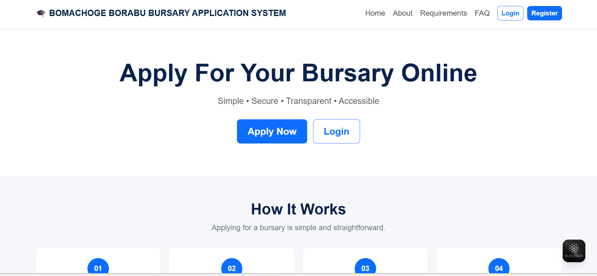
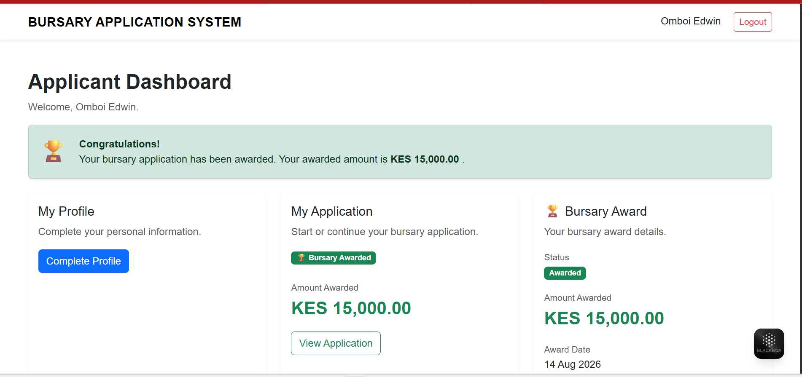
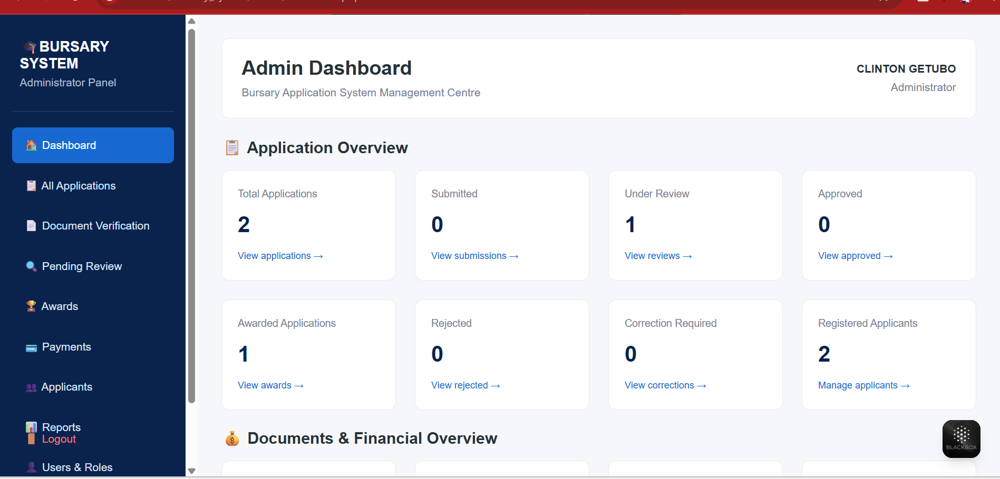
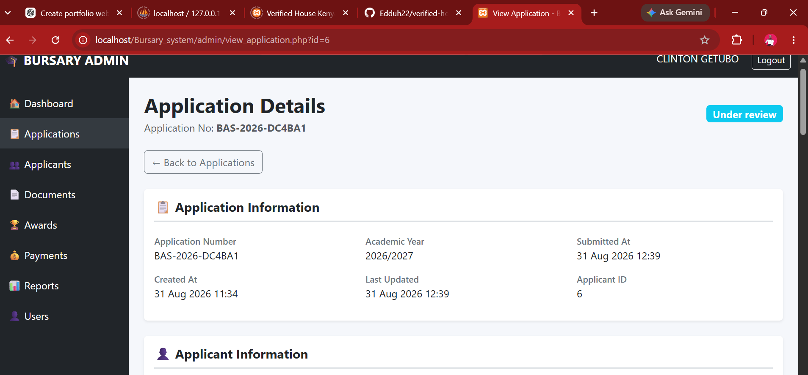

Bursary Application System

A web-based bursary application and management system developed using PHP, MySQL, Bootstrap, HTML, CSS and JavaScript.

The system provides an online platform where applicants can register, complete their profiles, submit bursary applications and track their application status. Administrators can verify documents, review applications, manage awards and payments, and generate reports.

Features

Applicant Module

- Applicant registration and login
- Applicant profile management
- Personal information
- Education information
- Guardian information
- Financial information
- Special circumstances
- Document submission
- Application review
- Online application submission
- Application status tracking

Administrator Module

- Secure administrator login
- Admin dashboard
- View and manage applications
- Document verification
- Application review
- Approve or reject applications
- Request application corrections
- Applicant management
- Awards management
- Payment management
- Reports
- User and role management
- System settings

 Application Workflow

Register
   ↓
Login
   ↓
Complete Profile
   ↓
Start Application
   ↓
Personal Information
   ↓
Education
   ↓
Guardian
   ↓
Financial Information
   ↓
Special Circumstances
   ↓
Documents
   ↓
Review Application
   ↓
Submit Application
   ↓
Document Verification
   ↓
Admin Review
   ↓
Approve / Reject / Correction
   ↓
Award
   ↓
Payment
   ↓
Completed

Screenshots

Home Page

Applicant Dashboard

Admin Dashboard

Application Review

